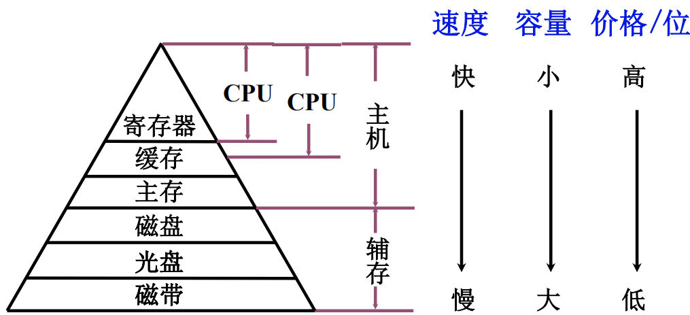
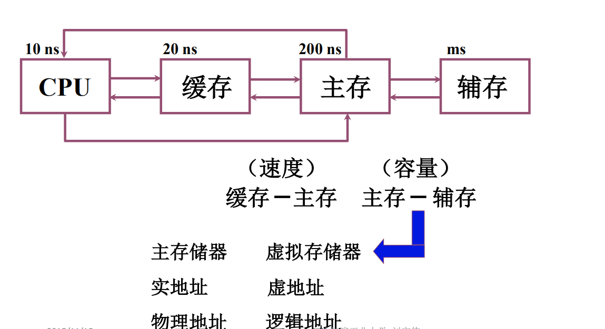

存储器是计算机最重要部件之一，执行程序需要的指令数据来自与存储器，各种资料也保存在存储器中。

# 存储器分类

存储器的分类方式有很多

## 按存储介质分类

### 半导体存储器(易失)

TTL(晶体管)，集成度低，功耗高，速度快

MOS(金属氧化物)， 功耗低，集成度高，主要用于计算机存储

### 磁表面存储器(不易失)

例如磁盘，有一个塑料或者合金的基片，在基片表面涂上磁层，通过磁化，不同方向存储不同的。磁层被分为若干个同心圆和扇区

### 磁芯存储器(不易失)

作为计算机系统的内存，磁芯只要流过电流就可以改变磁场。

硬磁材料，环状元件

### 光盘存储器(不易失)

激光，磁光材料

## 按存取方式分类

### 存取时间与地址无关(随机访问)

+ 随机存储器(RAM)，在程序的执行过程中可读可写
+ 只读存储器(ROM)，在程序的执行过程中只读

### 存取时间与物理地址有关（串行访问）

+ 顺序序取存储器 磁带
+ 直接存取存储器 磁盘

### 按计算机中的作用分类

#### 主存储器

+ RAM
  + 静态RAM
  + 动态RAM
+ ROM
  + MROM
  + PROM
  + EPROM
  + EEPROM

#### 辅助存储器

#### flash memory (便携式存储器)

可作为计算机硬盘，如果主存辅存之间速度过快可以作为缓冲

#### 高速缓冲存储器(Cache)

# 存储器的层次结构

## 存储器三个主要特性的关系

+ 速度
+ 容量
+ 价格

寄存器不仅仅CPU有，IO结构也有，有一些体系结构寄存器是机器语言用的，机器语言用不到的叫非体系寄存器。

缓存全在CPU中并不能提高系统速度，所以有一些缓存放在主板上。

### 为什么会有这么多的存储设备?

单一的任何一种都没法满足我们的需求，用户需要大速度，大容量，低价格，任何一种存储器都达不到，所以采用这种层次结构，形成一种存储体系。把两种及以上的存储器用软件或者硬件，软硬件相结合形成整体，这种整体可以达到三者合一。

## 缓存-主存层次和主存-辅存层次

CPU可以从主存读取信息，也可以把运算结果保存在主存中，主存的容量有限，程序大可能主存放不下，或者需要保存，所以需要使用辅存。

在程序的执行过程中，即使程序非常大，超过了主存，应用程序猿也不用去担心如何把程序进行分割，如何执行辅存中的程序，这些可以用这个体系来解决

缓存可以解决CPU速度和主存速度所带来的时间差，缓存中保存的是CPU最经常访问的内容，CPU所需要的指令都可以从缓存找到。

