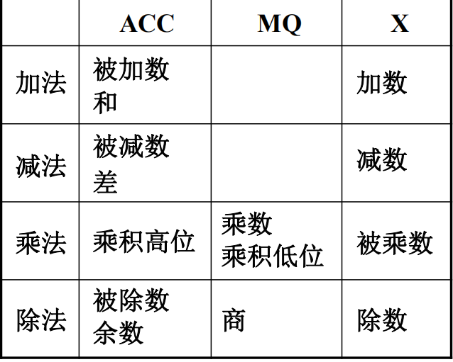

# 计算机系统的层次结构

通过封装可以分层一个复杂的计算机系统

0.微指令系统，语言在向上发展的同时还在向下发展，将机器语言进行译码，有些操作有时序，有些可以同时进行。

1.机器语言，硬件的机器，使用二进制代码对硬件进行编程。

1.5.操作系统，程序员通过操作系统提供的进行编程。

2.汇编语言，将机器语言符号化，将编程难度降低，硬件不能直接识别语言，必须由编译器转化成机器语。

3.高级语言，提供编译程序和解释程序生成目标程序，变成可执行代码，相当于在汇编外在加一层壳。
高级语言编程就是高级语言层层往下进行解释，汇编类似。

在机器语言及以下是真的由硬件操作的。

硬件和软件实现功能各有优劣，从程序员的角度划分为五层。

# 计算机基本组成

## 冯诺依曼计算机特点

现在的计算机都是存储程序结构的计算机，我们的数据程序都是以二进制形式存在计算机中，这种计算机我们称他为冯诺依曼计算机。因为这种思想设计在计算机中，所以称为冯诺依曼计算机。

具有存储程序的计算机都称为冯诺依曼计算机

### 冯诺依曼计算机有五大组成部分：

1.运算器，实现各总类型的运算。

2.控制器，进行运算的控制。

3.存储器，存储程序结构。

4.输入设备。

5.输出设备。

### 指令和数据

1.指令和数据以同等地位存储于存储器，可按地址寻访。

2.指令和数据都是二进制进行表示。

3.指令由操作码和地址码组成，操作码指明指令要做什么操作，地址码指明了地址的位置。

4.程序存放在存储器中。

5.以运算器位中心。

### 思考

1.如果设计计算机，是否一定要五个部件，五个部件是否可以结合在一起。比如：算盘
运算器：算盘珠，控制器：人，存储器：算盘珠，输入设备：手，输出设备：算盘珠。

2.既然指令和数据同等地位混合存储，我们可不可以把指令和数据存放在不同区域，是可以的，把指令放在指令区......

### 对冯诺依曼进行改进

#### 问题

1.以运算器为中心，是运算器成为计算机的瓶颈

2.图看上去乱，不具有层次感

#### 解决

将运算器为核心改为以存储器为核心，实现输入输出设备与存储器直进行数据传输。

#### 系统复杂性管理的范式

1.层次化：将被设计的系统划分为多个模块或子模块。
2.模块化：有明确定义的功能和借口。
3.规则性：模块更容易被重（cong）用。

### 问题

1.一个现实中的问题如何用计算机解决？

2.是不是所有的问题都可以用计算机解决？

3.假设我们遇到用计算机可以解决的计算机，如何用计算机解决？

## 计算机的工作流程

### 上机前的准备

+ 建立数学模型

+ 确定计算方法

+ 编制解题程序

  程序--运算的全步骤

  指令--每一个步骤 

+ 将指令和数据采用存储程序的方式保存在存储器中

## 存储器的基本组成

主存储器包含存储体和MAR和MDR

### 存储体

其中存储体中拥有存储单元，存储单元中含有存储元件，存储元件存放二进制代码

存储字：存在存储单元的二进制代码组合称为存储字

存储字长：存储单元中二进制代码的位长，每个存储单元存放了一个地址，一个存储单元存放一个存储字。

存储单元按照地址进行寻址。

#### 类比

存储体-存储单元-存储原件

大楼  -房间    -床位

### MAR

MAR是一个存储地址寄存器，保存了存储单元的地址，mar的位数和存储单元的个数有关。

### MDR

MDR是存储器数据寄存器，位数与存储字长有关

保存送入CPU的数据，要保存到存储体的数据，从存储体取出来的数据

## 运算器

### ALU

运算单元

通常是一个组合电路，为了使ALU对计算结果进行保存，必须在ALU的输入端加上寄存器，寄存器保存参与运算的数据，需要两个寄存器作为输入数据的保存设备。

### 连接了ACC,MQ,X三个寄存器

### ACC

累加寄存器

### MQ

乘商寄存器

### X

操作数寄存器

在设计的过程中要根据功能利用这些设备

## 控制器

### 控制器的功能

+ 解释指令
+ 保证指令按序进行

### 完成一条指令

1.取指令，将指令从内存单元取出，送入控制器

2.分析指令，把操作码部分送入控制单元进行分析

3.执行指令，由控制单元控制相应的执行部件，去完成相应的操作

### PC

程序计数器，保存了当前要执行的指令的地址，具有计数功能(PC+1)->PC

### IR

指令寄存器，存放当前即将执行的指令，控制单元可以从IR把指令码取出分析

### CU

控制单元，发出控制信号。

## 以上三种组成构成计算机的主机

