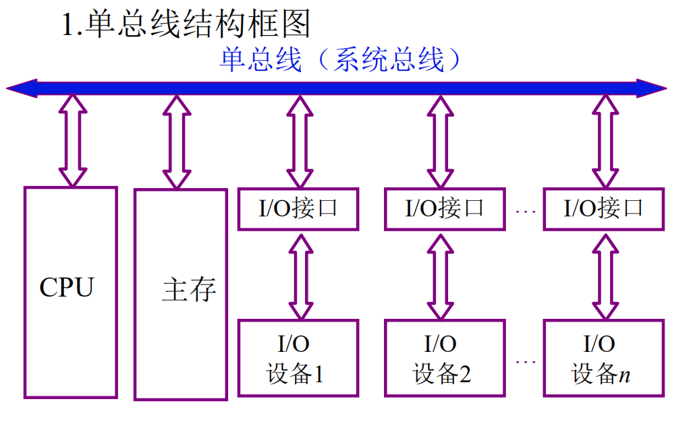
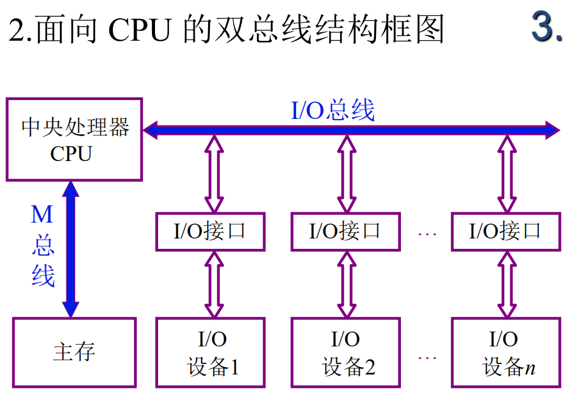
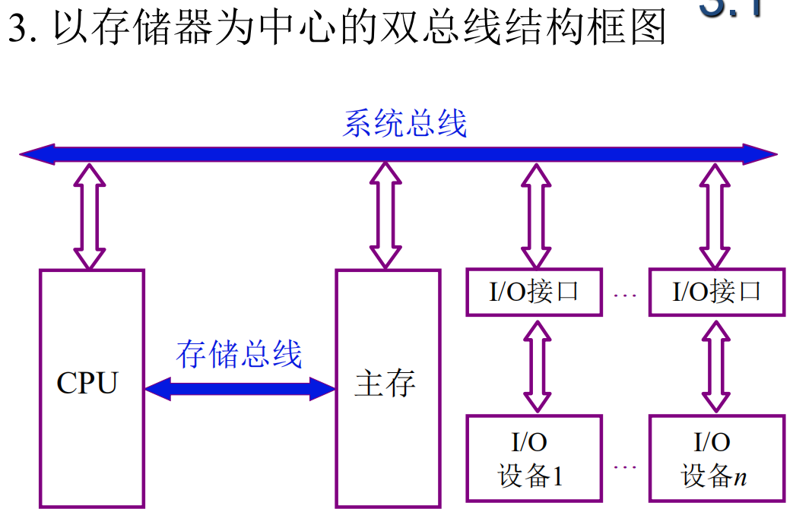

# 为什么要用总线

+ 现代计算机的结构比基本组成更加复杂，处理器数和外设数种类多。
+ 如果采用分散连接的方式，需要通讯的设备用线连接起来占用大量空间，例如很多部件要与CPU连接
+ 扩展较容易

# 什么是总线

总显示是连接各个部件的信息传输线，是各个部件共享的传输介质，

在任意时刻，只有一对设备可以使用总线，其他部件只能等待使用设备释放总线。

这种结构扩展性强

# 总线上信息的传输

## 串行

1.传输信息一位一位放在总线上，接收方一位一位接受

2.适合近距离的数据传输

3.用于设备与设备之间，机器间的传输

## 并行

1.传输方多位多位的放在总线上，接收方多位多位接受

2.线和线之间产生干扰，适合近距离的数据传输

3.集中在计算机机箱之中

# 总线结构的计算机举例

