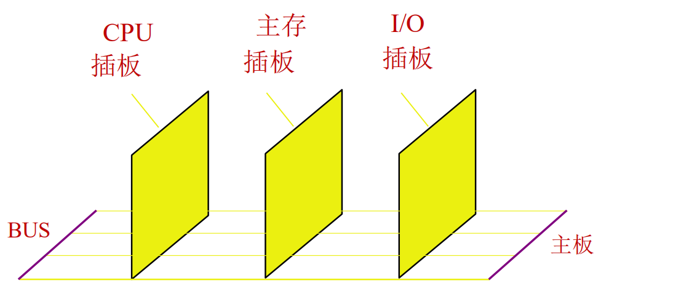
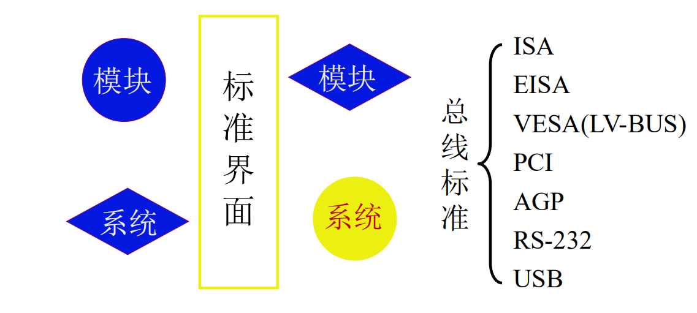
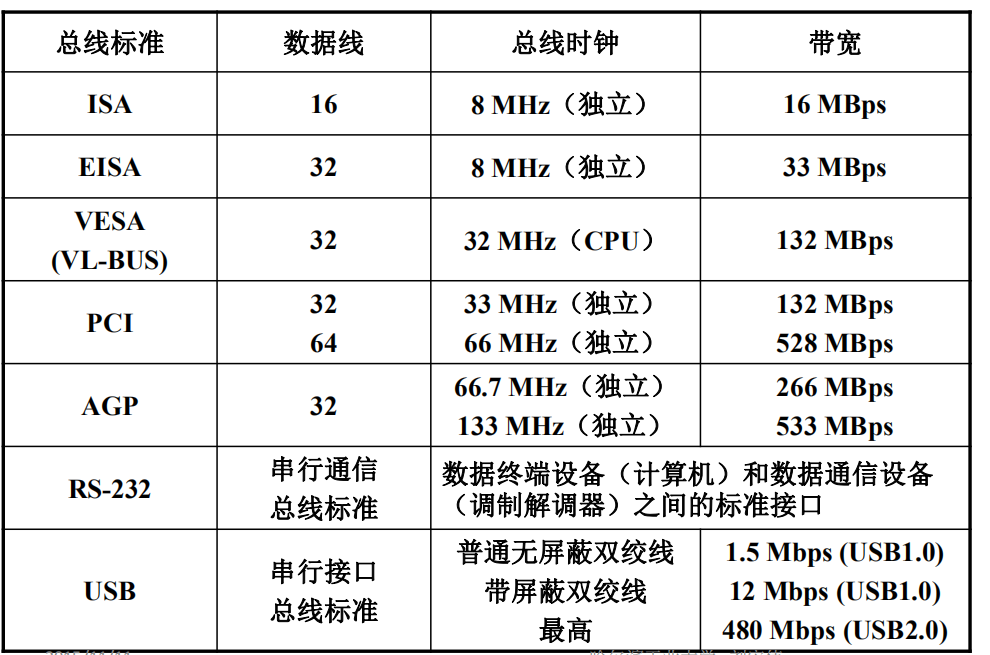

# 物理总线实现

# 总线特性

## 机械特性

尺寸，形状，管脚数，排列顺序

## 电气特性

传输方向，有效的电平范围

## 功能特性

### 每根传输的功能

+ 地址信号
+ 数据信号
+ 控制信号

## 时间特性

# 总线的性能指标

## 1.总线宽度

数据线的根数，根数越多，传输的数据位数越多，性能越好

## 2.标准传输率

每秒传输的最大字节数

## 3.时钟同步/异步

同步或者不同步

## 4.总线复用

地址线，数据线复用（公用），为了减少芯片的管脚数，这样封装体系减小了

例子：8086

## 5.信号线数

地址线，数据线，控制线的总和

## 6.总线的控制方式

突发，自动，仲裁，逻辑，计数

## 7.其他指标

负载能力

# 总线的标准

这个真不懂

有些标准逐步被淘汰

# 总线标准

